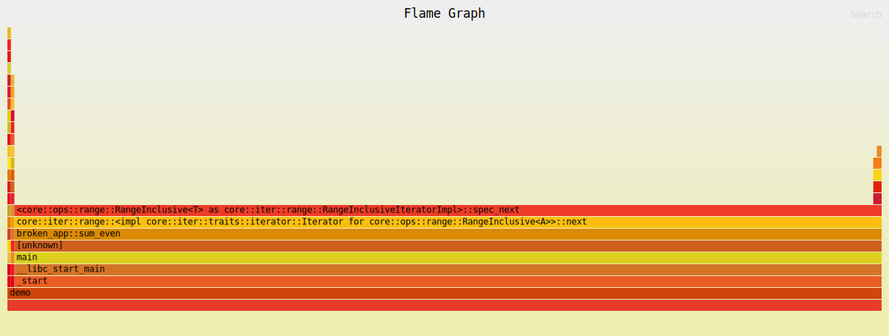

# broken_app

## Изначальная проверка - cargo check

```bash
user@aceplace:~/Rust/Yandex/projects/broken_app$ cargo check
warning[E0133]: dereference of raw pointer is unsafe and requires unsafe block
  --> src/lib.rs:60:15
   |
60 |     let val = *raw;
   |               ^^^^ dereference of raw pointer
   |
   = note: for more information, see <https://doc.rust-lang.org/edition-guide/rust-2024/unsafe-op-in-unsafe-fn.html>
   = note: raw pointers may be null, dangling or unaligned; they can violate aliasing rules and cause data races: all of these are undefined behavior
note: an unsafe function restricts its caller, but its body is safe by default
  --> src/lib.rs:57:1
   |
57 | pub unsafe fn use_after_free() -> i32 {
   | ^^^^^^^^^^^^^^^^^^^^^^^^^^^^^^^^^^^^^
   = note: `#[warn(unsafe_op_in_unsafe_fn)]` (part of `#[warn(rust_2024_compatibility)]`) on by default

warning[E0133]: call to unsafe function `std::boxed::Box::<T>::from_raw` is unsafe and requires unsafe block
  --> src/lib.rs:61:10
   |
61 |     drop(Box::from_raw(raw));
   |          ^^^^^^^^^^^^^^^^^^ call to unsafe function
   |
   = note: for more information, see <https://doc.rust-lang.org/edition-guide/rust-2024/unsafe-op-in-unsafe-fn.html>
   = note: consult the function's documentation for information on how to avoid undefined behavior

warning[E0133]: dereference of raw pointer is unsafe and requires unsafe block
  --> src/lib.rs:62:11
   |
62 |     val + *raw
   |           ^^^^ dereference of raw pointer
   |
   = note: for more information, see <https://doc.rust-lang.org/edition-guide/rust-2024/unsafe-op-in-unsafe-fn.html>
   = note: raw pointers may be null, dangling or unaligned; they can violate aliasing rules and cause data races: all of these are undefined behavior

For more information about this error, try `rustc --explain E0133`.
warning: `broken-app` (lib) generated 3 warnings (run `cargo fix --lib -p broken-app` to apply 1 suggestion)
    Finished `dev` profile [unoptimized + debuginfo] target(s) in 0.05s
```
## Проверка тестов - cargo test

```bash
user@aceplace:~/Rust/Yandex/projects/broken_app$ cargo test
warning[E0133]: dereference of raw pointer is unsafe and requires unsafe block
  --> src/lib.rs:60:15
   |
60 |     let val = *raw;
   |               ^^^^ dereference of raw pointer
   |
   = note: for more information, see <https://doc.rust-lang.org/edition-guide/rust-2024/unsafe-op-in-unsafe-fn.html>
   = note: raw pointers may be null, dangling or unaligned; they can violate aliasing rules and cause data races: all of these are undefined behavior
note: an unsafe function restricts its caller, but its body is safe by default
  --> src/lib.rs:57:1
   |
57 | pub unsafe fn use_after_free() -> i32 {
   | ^^^^^^^^^^^^^^^^^^^^^^^^^^^^^^^^^^^^^
   = note: `#[warn(unsafe_op_in_unsafe_fn)]` (part of `#[warn(rust_2024_compatibility)]`) on by default

warning[E0133]: call to unsafe function `std::boxed::Box::<T>::from_raw` is unsafe and requires unsafe block
  --> src/lib.rs:61:10
   |
61 |     drop(Box::from_raw(raw));
   |          ^^^^^^^^^^^^^^^^^^ call to unsafe function
   |
   = note: for more information, see <https://doc.rust-lang.org/edition-guide/rust-2024/unsafe-op-in-unsafe-fn.html>
   = note: consult the function's documentation for information on how to avoid undefined behavior

warning[E0133]: dereference of raw pointer is unsafe and requires unsafe block
  --> src/lib.rs:62:11
   |
62 |     val + *raw
   |           ^^^^ dereference of raw pointer
   |
   = note: for more information, see <https://doc.rust-lang.org/edition-guide/rust-2024/unsafe-op-in-unsafe-fn.html>
   = note: raw pointers may be null, dangling or unaligned; they can violate aliasing rules and cause data races: all of these are undefined behavior

For more information about this error, try `rustc --explain E0133`.
warning: `broken-app` (lib) generated 3 warnings (run `cargo fix --lib -p broken-app` to apply 1 suggestion)
warning: `broken-app` (lib test) generated 3 warnings (3 duplicates)
    Finished `test` profile [unoptimized + debuginfo] target(s) in 0.06s
     Running unittests src/lib.rs (target/debug/deps/broken_app-1fcfe3268fbb11df)

running 0 tests

test result: ok. 0 passed; 0 failed; 0 ignored; 0 measured; 0 filtered out; finished in 0.00s

     Running unittests src/bin/demo.rs (target/debug/deps/demo-48b0b01bb0836e32)

running 0 tests

test result: ok. 0 passed; 0 failed; 0 ignored; 0 measured; 0 filtered out; finished in 0.00s

     Running tests/integration.rs (target/debug/deps/integration-f368c4363e590c2a)

running 6 tests
test counts_non_zero_bytes ... ok
test averages_only_positive ... FAILED
test dedup_preserves_uniques ... ok

thread 'sums_even_numbers' (290911) panicked at src/lib.rs:11:29:
unsafe precondition(s) violated: slice::get_unchecked requires that the index is within the slice

This indicates a bug in the program. This Undefined Behavior check is optional, and cannot be relied on for safety.
thread caused non-unwinding panic. aborting.
error: test failed, to rerun pass `--test integration`

Caused by:
  process didn't exit successfully: `/home/user/Rust/Yandex/projects/broken_app/target/debug/deps/integration-f368c4363e590c2a` (signal: 6, SIGABRT: process abort signal)
```
## Проверка бенчмарков - cargo bench
```bash
user@aceplace:~/Rust/Yandex/projects/broken_app$ cargo bench
warning[E0133]: dereference of raw pointer is unsafe and requires unsafe block
  --> src/lib.rs:60:15
   |
60 |     let val = *raw;
   |               ^^^^ dereference of raw pointer
   |
   = note: for more information, see <https://doc.rust-lang.org/edition-guide/rust-2024/unsafe-op-in-unsafe-fn.html>
   = note: raw pointers may be null, dangling or unaligned; they can violate aliasing rules and cause data races: all of these are undefined behavior
note: an unsafe function restricts its caller, but its body is safe by default
  --> src/lib.rs:57:1
   |
57 | pub unsafe fn use_after_free() -> i32 {
   | ^^^^^^^^^^^^^^^^^^^^^^^^^^^^^^^^^^^^^
   = note: `#[warn(unsafe_op_in_unsafe_fn)]` (part of `#[warn(rust_2024_compatibility)]`) on by default

warning[E0133]: call to unsafe function `std::boxed::Box::<T>::from_raw` is unsafe and requires unsafe block
  --> src/lib.rs:61:10
   |
61 |     drop(Box::from_raw(raw));
   |          ^^^^^^^^^^^^^^^^^^ call to unsafe function
   |
   = note: for more information, see <https://doc.rust-lang.org/edition-guide/rust-2024/unsafe-op-in-unsafe-fn.html>
   = note: consult the function's documentation for information on how to avoid undefined behavior

warning[E0133]: dereference of raw pointer is unsafe and requires unsafe block
  --> src/lib.rs:62:11
   |
62 |     val + *raw
   |           ^^^^ dereference of raw pointer
   |
   = note: for more information, see <https://doc.rust-lang.org/edition-guide/rust-2024/unsafe-op-in-unsafe-fn.html>
   = note: raw pointers may be null, dangling or unaligned; they can violate aliasing rules and cause data races: all of these are undefined behavior

For more information about this error, try `rustc --explain E0133`.
warning: `broken-app` (lib) generated 3 warnings (run `cargo fix --lib -p broken-app` to apply 1 suggestion)
warning: unused import: `Duration`
 --> benches/baseline.rs:2:17
  |
2 | use std::time::{Duration, Instant};
  |                 ^^^^^^^^
  |
  = note: `#[warn(unused_imports)]` (part of `#[warn(unused)]`) on by default

warning: `broken-app` (lib test) generated 3 warnings (3 duplicates)
warning: `broken-app` (bench "baseline") generated 1 warning (run `cargo fix --bench "baseline" -p broken-app` to apply 1 suggestion)
    Finished `bench` profile [optimized] target(s) in 0.06s
     Running unittests src/lib.rs (target/release/deps/broken_app-da4dff30a8b84508)

running 0 tests

test result: ok. 0 passed; 0 failed; 0 ignored; 0 measured; 0 filtered out; finished in 0.00s

     Running unittests src/bin/demo.rs (target/release/deps/demo-4e6076337a466a98)

running 0 tests

test result: ok. 0 passed; 0 failed; 0 ignored; 0 measured; 0 filtered out; finished in 0.00s

     Running benches/baseline.rs (target/release/deps/baseline-25d40ca54b9b62bc)
```

## miri
```bash
user@aceplace:~/Rust/Yandex/projects/broken_app$ cargo +nightly miri run
warning[E0133]: dereference of raw pointer is unsafe and requires unsafe block
  --> src/lib.rs:60:15
   |
60 |     let val = *raw;
   |               ^^^^ dereference of raw pointer
   |
   = note: raw pointers may be null, dangling or unaligned; they can violate aliasing rules and cause data races: all of these are undefined behavior
note: an unsafe function restricts its caller, but its body is safe by default
  --> src/lib.rs:57:1
   |
57 | pub unsafe fn use_after_free() -> i32 {
   | ^^^^^^^^^^^^^^^^^^^^^^^^^^^^^^^^^^^^^
   = note: for more information, see <https://doc.rust-lang.org/edition-guide/rust-2024/unsafe-op-in-unsafe-fn.html>
   = note: `#[warn(unsafe_op_in_unsafe_fn)]` (part of `#[warn(rust_2024_compatibility)]`) on by default

warning[E0133]: call to unsafe function `std::boxed::Box::<T>::from_raw` is unsafe and requires unsafe block
  --> src/lib.rs:61:10
   |
61 |     drop(Box::from_raw(raw));
   |          ^^^^^^^^^^^^^^^^^^ call to unsafe function
   |
   = note: consult the function's documentation for information on how to avoid undefined behavior
   = note: for more information, see <https://doc.rust-lang.org/edition-guide/rust-2024/unsafe-op-in-unsafe-fn.html>

warning[E0133]: dereference of raw pointer is unsafe and requires unsafe block
  --> src/lib.rs:62:11
   |
62 |     val + *raw
   |           ^^^^ dereference of raw pointer
   |
   = note: raw pointers may be null, dangling or unaligned; they can violate aliasing rules and cause data races: all of these are undefined behavior
   = note: for more information, see <https://doc.rust-lang.org/edition-guide/rust-2024/unsafe-op-in-unsafe-fn.html>

For more information about this error, try `rustc --explain E0133`.
warning: `broken-app` (lib) generated 3 warnings (run `cargo fix --lib -p broken-app` to apply 1 suggestion)
    Finished `dev` profile [unoptimized + debuginfo] target(s) in 0.04s
     Running `/home/user/.rustup/toolchains/nightly-x86_64-unknown-linux-gnu/bin/cargo-miri runner target/miri/x86_64-unknown-linux-gnu/debug/demo`
error: Undefined Behavior: `assume` called with `false`
  --> src/lib.rs:11:22
   |
11 |             let v = *values.get_unchecked(idx);
   |                      ^^^^^^^^^^^^^^^^^^^^^^^^^ Undefined Behavior occurred here
   |
   = help: this indicates a bug in the program: it performed an invalid operation, and caused Undefined Behavior
   = help: see https://doc.rust-lang.org/nightly/reference/behavior-considered-undefined.html for further information
   = note: stack backtrace:
           0: broken_app::sum_even
               at src/lib.rs:11:22: 11:47
           1: main
               at src/bin/demo.rs:5:30: 5:45

note: some details are omitted, run with `MIRIFLAGS=-Zmiri-backtrace=full` for a verbose backtrace

error: aborting due to 1 previous error
```

## valgrind

```bash
user@aceplace:~/Rust/Yandex/projects/broken_app$ valgrind --leak-check=full --show-leak-kinds=all target/debug/demo
==328178== Memcheck, a memory error detector
==328178== Copyright (C) 2002-2024, and GNU GPL'd, by Julian Seward et al.
==328178== Using Valgrind-3.26.0 and LibVEX; rerun with -h for copyright info
==328178== Command: target/debug/demo
==328178== 

thread 'main' (328178) panicked at src/lib.rs:11:29:
unsafe precondition(s) violated: slice::get_unchecked requires that the index is within the slice

This indicates a bug in the program. This Undefined Behavior check is optional, and cannot be relied on for safety.
note: run with `RUST_BACKTRACE=1` environment variable to display a backtrace
thread caused non-unwinding panic. aborting.
==328178== 
==328178== Process terminating with default action of signal 6 (SIGABRT)
==328178==    at 0x49C548C: __pthread_kill_implementation (pthread_kill.c:44)
==328178==    by 0x49C548C: __pthread_kill_internal (pthread_kill.c:89)
==328178==    by 0x49C548C: pthread_kill@@GLIBC_2.34 (pthread_kill.c:100)
==328178==    by 0x4964B7D: raise (raise.c:26)
==328178==    by 0x49478EB: abort (abort.c:77)
==328178==    by 0x4032F19: std::sys::pal::unix::abort_internal (mod.rs:363)
==328178==    by 0x40370B8: std::process::abort (process.rs:2535)
==328178==    by 0x40376E9: std::panicking::panic_with_hook (panicking.rs:0)
==328178==    by 0x4037459: std::panicking::panic_handler::{{closure}} (panicking.rs:691)
==328178==    by 0x4035A88: std::sys::backtrace::__rust_end_short_backtrace (backtrace.rs:176)
==328178==    by 0x402585C: __rustc::rust_begin_unwind (panicking.rs:689)
==328178==    by 0x406451C: runtime (panicking.rs:122)
==328178==    by 0x406451C: core::panicking::panic_nounwind_fmt (mod.rs:2449)
==328178==    by 0x40254E3: <usize as core::slice::index::SliceIndex<[T]>>::get_unchecked::precondition_check (ub_checks.rs:73)
==328178==    by 0x4024478: <usize as core::slice::index::SliceIndex<[T]>>::get_unchecked (ub_checks.rs:78)
==328178== 
==328178== HEAP SUMMARY:
==328178==     in use at exit: 548 bytes in 2 blocks
==328178==   total heap usage: 9 allocs, 7 frees, 2,620 bytes allocated
==328178== 
==328178== 4 bytes in 1 blocks are still reachable in loss record 1 of 2
==328178==    at 0x48B6858: malloc (vg_replace_malloc.c:447)
==328178==    by 0x4032FE7: alloc (alloc.rs:95)
==328178==    by 0x4032FE7: alloc_impl (alloc.rs:190)
==328178==    by 0x4032FE7: allocate (alloc.rs:251)
==328178==    by 0x4032FE7: try_clone_from_ref_in<str, alloc::alloc::Global> (boxed.rs:840)
==328178==    by 0x4032FE7: clone_from_ref_in<str, alloc::alloc::Global> (boxed.rs:799)
==328178==    by 0x4032FE7: clone_from_ref<str> (boxed.rs:752)
==328178==    by 0x4032FE7: from (convert.rs:138)
==328178==    by 0x4032FE7: call_once<fn(&str) -> alloc::boxed::Box<str, alloc::alloc::Global>, (&str)> (function.rs:250)
==328178==    by 0x4032FE7: map<&str, alloc::boxed::Box<str, alloc::alloc::Global>, fn(&str) -> alloc::boxed::Box<str, alloc::alloc::Global>> (option.rs:1165)
==328178==    by 0x4032FE7: {closure#0} (thread_info.rs:114)
==328178==    by 0x4032FE7: {closure#0}<std::sys::pal::unix::stack_overflow::thread_info::set_current_info::{closure_env#0}, core::option::Option<alloc::boxed::Box<str, alloc::alloc::Global>>> (current.rs:234)
==328178==    by 0x4032FE7: try_with_current<std::thread::current::with_current_name::{closure_env#0}<std::sys::pal::unix::stack_overflow::thread_info::set_current_info::{closure_env#0}, core::option::Option<alloc::boxed::Box<str, alloc::alloc::Global>>>, core::option::Option<alloc::boxed::Box<str, alloc::alloc::Global>>> (current.rs:204)
==328178==    by 0x4032FE7: with_current_name<std::sys::pal::unix::stack_overflow::thread_info::set_current_info::{closure_env#0}, core::option::Option<alloc::boxed::Box<str, alloc::alloc::Global>>> (current.rs:216)
==328178==    by 0x4032FE7: std::sys::pal::unix::stack_overflow::thread_info::set_current_info (thread_info.rs:114)
==328178==    by 0x4031A9E: init (stack_overflow.rs:179)
==328178==    by 0x4031A9E: init (mod.rs:42)
==328178==    by 0x4031A9E: init (rt.rs:118)
==328178==    by 0x4031A9E: {closure#0} (rt.rs:173)
==328178==    by 0x4031A9E: do_call<std::rt::lang_start_internal::{closure_env#0}, isize> (panicking.rs:581)
==328178==    by 0x4031A9E: catch_unwind<isize, std::rt::lang_start_internal::{closure_env#0}> (panicking.rs:544)
==328178==    by 0x4031A9E: catch_unwind<std::rt::lang_start_internal::{closure_env#0}, isize> (panic.rs:359)
==328178==    by 0x4031A9E: std::rt::lang_start_internal (rt.rs:171)
==328178==    by 0x401CE76: std::rt::lang_start (rt.rs:205)
==328178==    by 0x401C83D: main (in /home/user/Rust/Yandex/projects/broken_app/target/debug/demo)
==328178== 
==328178== 544 bytes in 1 blocks are still reachable in loss record 2 of 2
==328178==    at 0x48B6858: malloc (vg_replace_malloc.c:447)
==328178==    by 0x40331EC: alloc (alloc.rs:95)
==328178==    by 0x40331EC: alloc_impl (alloc.rs:190)
==328178==    by 0x40331EC: allocate (alloc.rs:251)
==328178==    by 0x40331EC: try_new_uninit_in<alloc::collections::btree::node::LeafNode<usize, std::sys::pal::unix::stack_overflow::thread_info::ThreadInfo>, alloc::alloc::Global> (boxed.rs:582)
==328178==    by 0x40331EC: new_uninit_in<alloc::collections::btree::node::LeafNode<usize, std::sys::pal::unix::stack_overflow::thread_info::ThreadInfo>, alloc::alloc::Global> (boxed.rs:549)
==328178==    by 0x40331EC: new<usize, std::sys::pal::unix::stack_overflow::thread_info::ThreadInfo, alloc::alloc::Global> (node.rs:87)
==328178==    by 0x40331EC: new_leaf<usize, std::sys::pal::unix::stack_overflow::thread_info::ThreadInfo, alloc::alloc::Global> (node.rs:225)
==328178==    by 0x40331EC: insert_entry<usize, std::sys::pal::unix::stack_overflow::thread_info::ThreadInfo, alloc::alloc::Global> (entry.rs:403)
==328178==    by 0x40331EC: insert<usize, std::sys::pal::unix::stack_overflow::thread_info::ThreadInfo, alloc::alloc::Global> (entry.rs:377)
==328178==    by 0x40331EC: insert<usize, std::sys::pal::unix::stack_overflow::thread_info::ThreadInfo, alloc::alloc::Global> (map.rs:1053)
==328178==    by 0x40331EC: std::sys::pal::unix::stack_overflow::thread_info::set_current_info (thread_info.rs:122)
==328178==    by 0x4031A9E: init (stack_overflow.rs:179)
==328178==    by 0x4031A9E: init (mod.rs:42)
==328178==    by 0x4031A9E: init (rt.rs:118)
==328178==    by 0x4031A9E: {closure#0} (rt.rs:173)
==328178==    by 0x4031A9E: do_call<std::rt::lang_start_internal::{closure_env#0}, isize> (panicking.rs:581)
==328178==    by 0x4031A9E: catch_unwind<isize, std::rt::lang_start_internal::{closure_env#0}> (panicking.rs:544)
==328178==    by 0x4031A9E: catch_unwind<std::rt::lang_start_internal::{closure_env#0}, isize> (panic.rs:359)
==328178==    by 0x4031A9E: std::rt::lang_start_internal (rt.rs:171)
==328178==    by 0x401CE76: std::rt::lang_start (rt.rs:205)
==328178==    by 0x401C83D: main (in /home/user/Rust/Yandex/projects/broken_app/target/debug/demo)
==328178== 
==328178== LEAK SUMMARY:
==328178==    definitely lost: 0 bytes in 0 blocks
==328178==    indirectly lost: 0 bytes in 0 blocks
==328178==      possibly lost: 0 bytes in 0 blocks
==328178==    still reachable: 548 bytes in 2 blocks
==328178==         suppressed: 0 bytes in 0 blocks
==328178== 
==328178== For lists of detected and suppressed errors, rerun with: -s
==328178== ERROR SUMMARY: 0 errors from 0 contexts (suppressed: 0 from 0)
Аварийный останов      (образ памяти сброшен на диск) valgrind --leak-check=full --show-leak-kinds=all target/debug/demo
```

## flamegraph
```bash
user@XiaomiBookPro16:~/Practicum/broken_app$ sudo sysctl kernel.perf_event_paranoid=0
cargo flamegraph --bin demo
[sudo] пароль для user:
kernel.perf_event_paranoid = 0
warning[E0133]: dereference of raw pointer is unsafe and requires unsafe block
  --> src/lib.rs:60:15
   |
60 |     let val = *raw;
   |               ^^^^ dereference of raw pointer
   |
   = note: raw pointers may be null, dangling or unaligned; they can violate aliasing rules and cause data races: all of these are undefined behavior
note: an unsafe function restricts its caller, but its body is safe by default
  --> src/lib.rs:57:1
   |
57 | pub unsafe fn use_after_free() -> i32 {
   | ^^^^^^^^^^^^^^^^^^^^^^^^^^^^^^^^^^^^^
   = note: for more information, see <https://doc.rust-lang.org/edition-guide/rust-2024/unsafe-op-in-unsafe-fn.html>
   = note: `#[warn(unsafe_op_in_unsafe_fn)]` (part of `#[warn(rust_2024_compatibility)]`) on by default

warning[E0133]: call to unsafe function `std::boxed::Box::<T>::from_raw` is unsafe and requires unsafe block
  --> src/lib.rs:61:10
   |
61 |     drop(Box::from_raw(raw));
   |          ^^^^^^^^^^^^^^^^^^ call to unsafe function
   |
   = note: consult the function's documentation for information on how to avoid undefined behavior
   = note: for more information, see <https://doc.rust-lang.org/edition-guide/rust-2024/unsafe-op-in-unsafe-fn.html>

warning[E0133]: dereference of raw pointer is unsafe and requires unsafe block
  --> src/lib.rs:62:11
   |
62 |     val + *raw
   |           ^^^^ dereference of raw pointer
   |
   = note: raw pointers may be null, dangling or unaligned; they can violate aliasing rules and cause data races: all of these are undefined behavior
   = note: for more information, see <https://doc.rust-lang.org/edition-guide/rust-2024/unsafe-op-in-unsafe-fn.html>

For more information about this error, try `rustc --explain E0133`.
warning: `broken-app` (lib) generated 3 warnings (run `cargo fix --lib -p broken-app` to apply 1 suggestion)
    Finished `release` profile [optimized + debuginfo] target(s) in 0.11s
WARNING: Kernel address maps (/proc/{kallsyms,modules}) are restricted,
check /proc/sys/kernel/kptr_restrict and /proc/sys/kernel/perf_event_paranoid.

Samples in kernel functions may not be resolved if a suitable vmlinux
file is not found in the buildid cache or in the vmlinux path.

Samples in kernel modules won't be resolved at all.

If some relocation was applied (e.g. kexec) symbols may be misresolved
even with a suitable vmlinux or kallsyms file.

Couldn't record kernel reference relocation symbol
Symbol resolution may be skewed if relocation was used (e.g. kexec).
Check /proc/kallsyms permission or run as root.
^C[ perf record: Woken up 8829 times to write data ]
Warning:
Processed 44962 events and lost 1 chunks!

Check IO/CPU overload!

[ perf record: Captured and wrote 2209,888 MB perf.data (36071 samples) ]
Running perf script [5s]:                                                     writing flamegraph to "flamegraph.svg"
```


# После исправления

## cargo check

```bash
user@XiaomiBookPro16:~/Practicum/broken_app$ cargo check
    Finished `dev` profile [unoptimized + debuginfo] target(s) in 0.13s
```

## cargo test

```bash
user@XiaomiBookPro16:~/Practicum/broken_app$ cargo test
   Compiling broken-app v0.1.0 (/home/user/Practicum/broken_app)
    Finished `test` profile [unoptimized + debuginfo] target(s) in 0.37s
     Running unittests src/lib.rs (target/debug/deps/broken_app-304e8b1438a718f1)

running 0 tests

test result: ok. 0 passed; 0 failed; 0 ignored; 0 measured; 0 filtered out; finished in 0.00s

     Running unittests src/bin/demo.rs (target/debug/deps/demo-5eda75142db377f3)

running 0 tests

test result: ok. 0 passed; 0 failed; 0 ignored; 0 measured; 0 filtered out; finished in 0.00s

     Running tests/integration.rs (target/debug/deps/integration-310ec0eb5271551d)

running 6 tests
test fib_small_numbers ... ok
test averages_only_positive ... ok
test normalize_simple ... ok
test dedup_preserves_uniques ... ok
test counts_non_zero_bytes ... ok
test sums_even_numbers ... ok

test result: ok. 6 passed; 0 failed; 0 ignored; 0 measured; 0 filtered out; finished in 0.00s

   Doc-tests broken_app

running 0 tests

test result: ok. 0 passed; 0 failed; 0 ignored; 0 measured; 0 filtered out; finished in 0.00s
```
## cargo bench

```bash
user@XiaomiBookPro16:~/Practicum/broken_app$ cargo bench
   Compiling broken-app v0.1.0 (/home/user/Practicum/broken_app)
    Finished `bench` profile [optimized] target(s) in 0.39s
     Running unittests src/lib.rs (target/release/deps/broken_app-c7bb5168b7a0df2d)

running 0 tests

test result: ok. 0 passed; 0 failed; 0 ignored; 0 measured; 0 filtered out; finished in 0.00s

     Running unittests src/bin/demo.rs (target/release/deps/demo-68a3098f77725383)

running 0 tests

test result: ok. 0 passed; 0 failed; 0 ignored; 0 measured; 0 filtered out; finished in 0.00s

     Running benches/baseline.rs (target/release/deps/baseline-79ad688cb5449ace)
sum_even: 48.07µs
slow_fib: 756ns
slow_dedup: 579.447µs
sum_even: 66.14µs
slow_fib: 365ns
slow_dedup: 410.76µs
sum_even: 43.797µs
slow_fib: 193ns
slow_dedup: 325.961µs
     Running benches/criterion.rs (target/release/deps/criterion-8aab99522dbf3fb8)

running 0 tests

test result: ok. 0 passed; 0 failed; 0 ignored; 0 measured; 0 filtered out; finished in 0.00s

```

## miri
```bash
user@XiaomiBookPro16:~/Practicum/broken_app$ cargo +nightly miri run
    Finished `dev` profile [unoptimized + debuginfo] target(s) in 0.04s
     Running `/home/user/.rustup/toolchains/nightly-x86_64-unknown-linux-gnu/bin/cargo-miri runner target/miri/x86_64-unknown-linux-gnu/debug/demo`
sum_even: 6
non-zero bytes: 3
normalize: helloworld
fib(20): 6765
dedup: [1, 2, 3, 4]
```

## valgrind
```bash
user@XiaomiBookPro16:~/Practicum/broken_app$ valgrind --leak-check=full --show-leak-kinds=all target/debug/demo
==11190== Memcheck, a memory error detector
==11190== Copyright (C) 2002-2026, and GNU GPL'd, by Julian Seward et al.
==11190== Using Valgrind-3.27.0 and LibVEX; rerun with -h for copyright info
==11190== Command: target/debug/demo
==11190== 
sum_even: 6
non-zero bytes: 3
normalize: helloworld
fib(20): 6765
dedup: [1, 2, 3, 4]
==11190== 
==11190== HEAP SUMMARY:
==11190==     in use at exit: 544 bytes in 1 blocks
==11190==   total heap usage: 15 allocs, 14 frees, 3,822 bytes allocated
==11190== 
==11190== 544 bytes in 1 blocks are still reachable in loss record 1 of 1
==11190==    at 0x48B8858: malloc (in /usr/libexec/valgrind/vgpreload_memcheck-amd64-linux.so)
==11190==    by 0x4053D69: alloc (alloc.rs:95)
==11190==    by 0x4053D69: alloc_impl_runtime (alloc.rs:190)
==11190==    by 0x4053D69: alloc_impl (alloc.rs:312)
==11190==    by 0x4053D69: allocate (alloc.rs:429)
==11190==    by 0x4053D69: try_new_uninit_in<alloc::collections::btree::node::LeafNode<usize, std::sys::pal::unix::stack_overflow::thread_info::ThreadInfo>, alloc::alloc::Global> (boxed.rs:614)
==11190==    by 0x4053D69: new_uninit_in<alloc::collections::btree::node::LeafNode<usize, std::sys::pal::unix::stack_overflow::thread_info::ThreadInfo>, alloc::alloc::Global> (boxed.rs:581)
==11190==    by 0x4053D69: new<usize, std::sys::pal::unix::stack_overflow::thread_info::ThreadInfo, alloc::alloc::Global> (node.rs:87)
==11190==    by 0x4053D69: new_leaf<usize, std::sys::pal::unix::stack_overflow::thread_info::ThreadInfo, alloc::alloc::Global> (node.rs:225)
==11190==    by 0x4053D69: insert_entry<usize, std::sys::pal::unix::stack_overflow::thread_info::ThreadInfo, alloc::alloc::Global> (entry.rs:403)
==11190==    by 0x4053D69: insert<usize, std::sys::pal::unix::stack_overflow::thread_info::ThreadInfo, alloc::alloc::Global> (entry.rs:377)
==11190==    by 0x4053D69: insert<usize, std::sys::pal::unix::stack_overflow::thread_info::ThreadInfo, alloc::alloc::Global> (map.rs:1053)
==11190==    by 0x4053D69: std::sys::pal::unix::stack_overflow::thread_info::set_current_info (thread_info.rs:122)
==11190==    by 0x4050DBC: init (stack_overflow.rs:179)
==11190==    by 0x4050DBC: init (mod.rs:41)
==11190==    by 0x4050DBC: init (rt.rs:118)
==11190==    by 0x4050DBC: {closure#0} (rt.rs:173)
==11190==    by 0x4050DBC: do_call<std::rt::lang_start_internal::{closure_env#0}, isize> (panicking.rs:581)
==11190==    by 0x4050DBC: catch_unwind<isize, std::rt::lang_start_internal::{closure_env#0}> (panicking.rs:544)
==11190==    by 0x4050DBC: catch_unwind<std::rt::lang_start_internal::{closure_env#0}, isize> (panic.rs:359)
==11190==    by 0x4050DBC: std::rt::lang_start_internal (rt.rs:171)
==11190==    by 0x401E6D6: std::rt::lang_start (rt.rs:205)
==11190==    by 0x401EBFD: main (in /home/user/Practicum/broken_app/target/debug/demo)
==11190== 
==11190== LEAK SUMMARY:
==11190==    definitely lost: 0 bytes in 0 blocks
==11190==    indirectly lost: 0 bytes in 0 blocks
==11190==      possibly lost: 0 bytes in 0 blocks
==11190==    still reachable: 544 bytes in 1 blocks
==11190==         suppressed: 0 bytes in 0 blocks
==11190== 
==11190== For lists of detected and suppressed errors, rerun with: -s
==11190== ERROR SUMMARY: 0 errors from 0 contexts (suppressed: 0 from 0)
```

## flamegraph
```bash
user@XiaomiBookPro16:~/Practicum/broken_app$ cargo flamegraph --bin demo
    Finished `release` profile [optimized + debuginfo] target(s) in 0.04s
Failed to read max cpus, using default of 4096
WARNING: Kernel address maps (/proc/{kallsyms,modules}) are restricted,
check /proc/sys/kernel/kptr_restrict and /proc/sys/kernel/perf_event_paranoid.

Samples in kernel functions may not be resolved if a suitable vmlinux
file is not found in the buildid cache or in the vmlinux path.

Samples in kernel modules won't be resolved at all.

If some relocation was applied (e.g. kexec) symbols may be misresolved
even with a suitable vmlinux or kallsyms file.

Couldn't record kernel reference relocation symbol
Symbol resolution may be skewed if relocation was used (e.g. kexec).
Check /proc/kallsyms permission or run as root.
sum_even: 6
non-zero bytes: 3
normalize: helloworld
fib(20): 6765
dedup: [1, 2, 3, 4]
[ perf record: Woken up 1 times to write data ]
[ perf record: Captured and wrote 0,189 MB perf.data (3 samples) ]
Running perf script [0s]:                                                                                                                                                        writing flamegraph to "flamegraph.svg"
```

